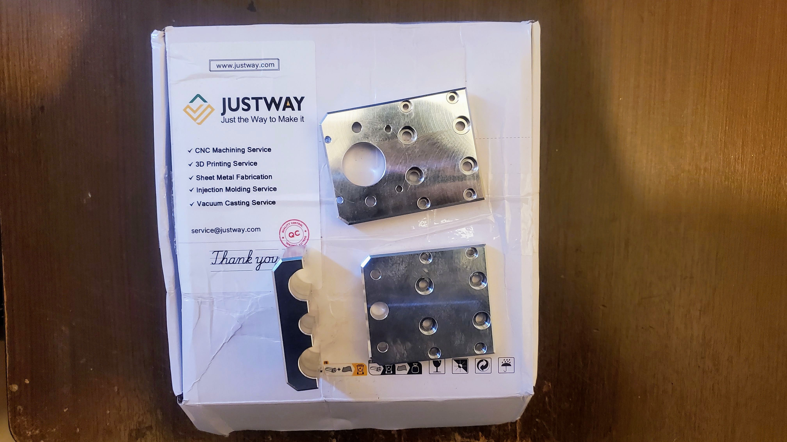

# CNC-3018-Pro-Upgrade
Redesign and upgrade of a **CNC 3018 Pro**, including a new V-Slot aluminum frame, custom X-Z carriage, CNC-machined aluminum parts, and a custom ESP32-based controller running FluidNC.

## Mechanical Redesign

### New V-Slot Frame

The original CNC 3018 frame was redesigned using **V-Slot aluminum profiles** to improve rigidity and provide a stronger and more modular structure.

### Custom X-Z Carriage

A new **X-Z carriage** was designed for the spindle, adapting the machine to the new frame and improving the mechanical assembly.

## CNC Machined Parts

The custom aluminum parts for the new mechanical assembly were CNC machined with the support of **JUSTWAY**.

## Manufacturing Sponsorship

Special thanks to **JUSTWAY** for supporting the project through
the CNC machining and manufacturing of the custom aluminum parts.

  

## Custom Electronics

A new **ESP32-based controller board** was designed to replace the original CNC electronics and provide the interface for the stepper motors, spindle, limit switches, and other machine functions.

## FluidNC

The controller runs **FluidNC**, providing configuration and control of the CNC machine through its web interface.

## Project

**Mechanical Design · CNC Manufacturing · Electronics · FluidNC**

**Developed by Cristian Guerrero**

