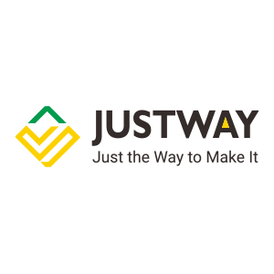
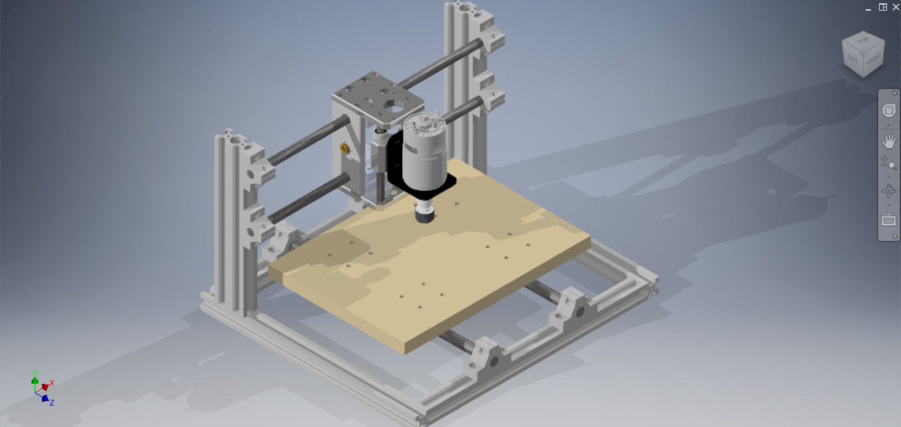
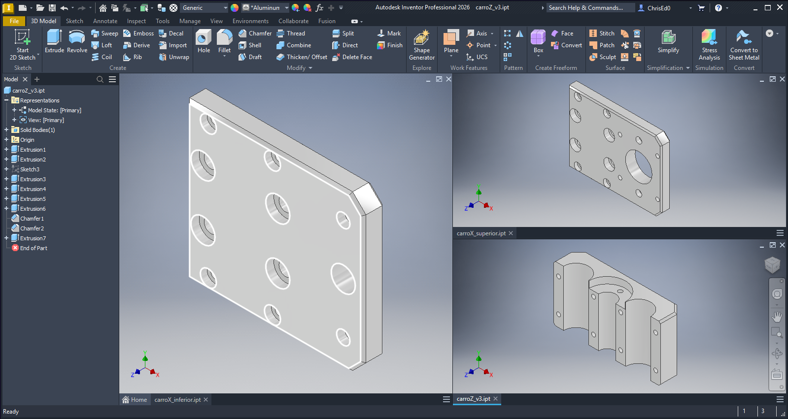
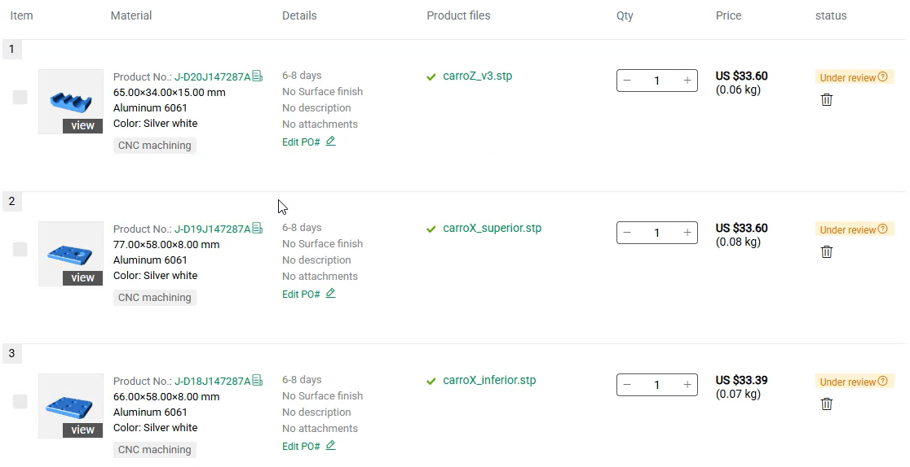
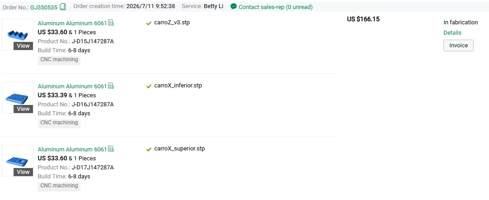
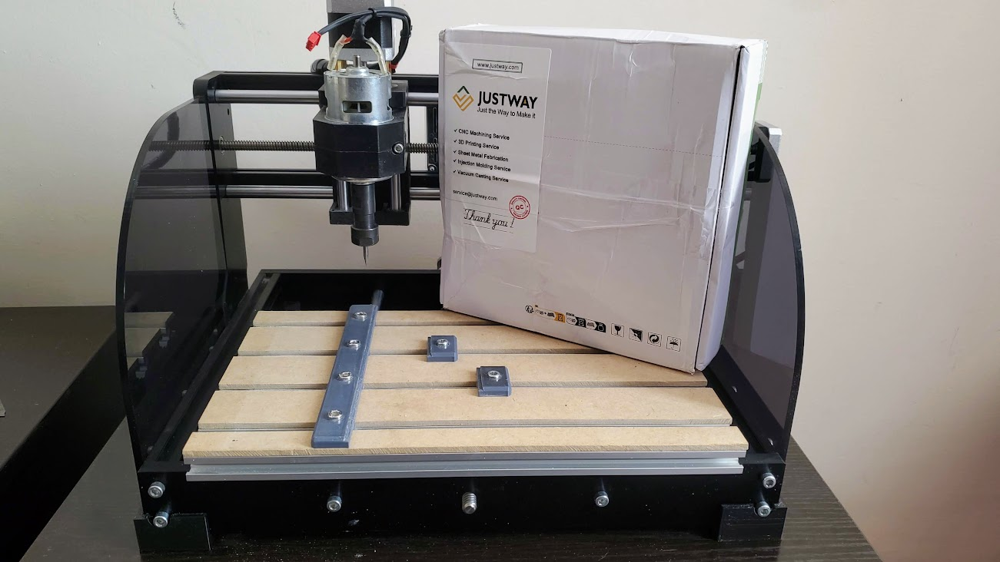
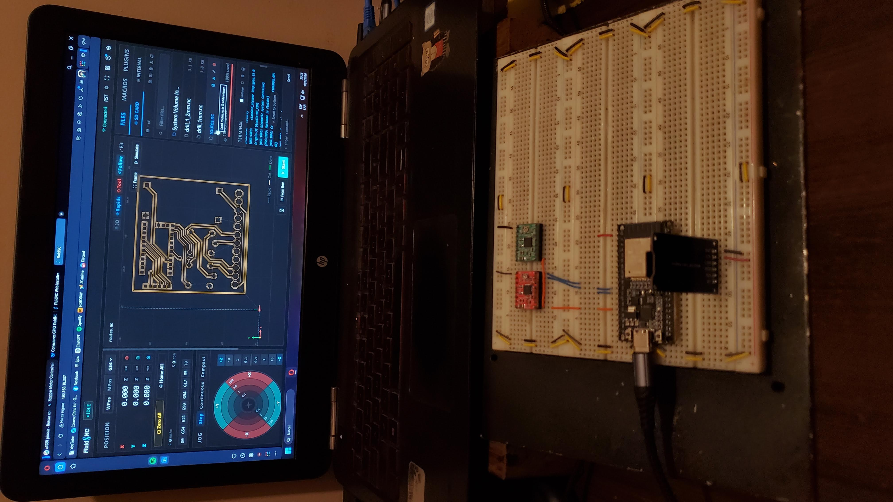
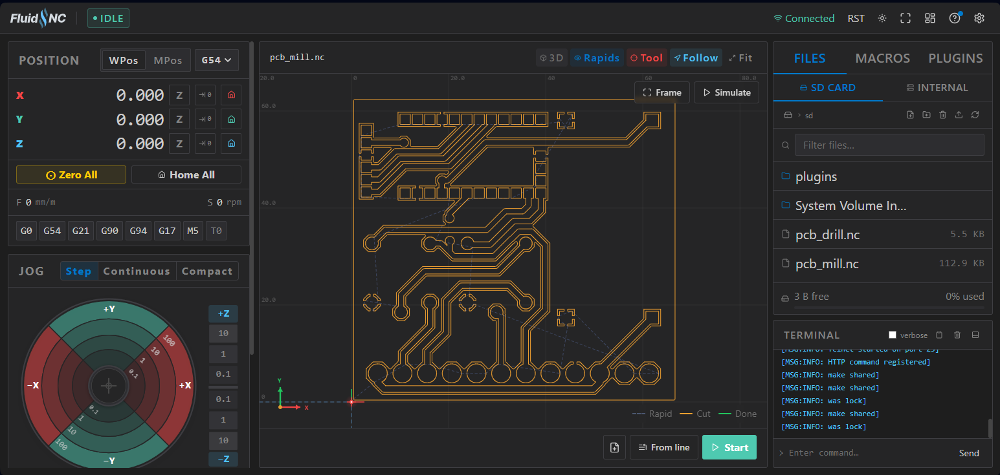

# **CNC 3018 Upgrade**
# JUSTWAY Services and Sponsorship

**JUSTWAY** is an online manufacturing platform that provides custom manufacturing services, including **CNC machining, 3D printing, sheet metal fabrication, injection molding, PCB assembly, and rapid prototyping**.

For this project, JUSTWAY supported the development of the CNC 3018 upgrade by sponsoring the **CNC machining of custom aluminum parts** for the new X-Z carriage and spindle assembly.

---

# CNC 3018 Upgrade Project

The **CNC 3018 Upgrade Project** focuses on redesigning and improving a CNC 3018 Pro.

### Main Improvements

* New V-Slot aluminum profile frame.
* Custom X-Z carriage.
* CNC-machined aluminum components.
* New spindle mounting system.
* Custom ESP32-based electronics.
* FluidNC CNC controller.

### Mechanical Design

The custom aluminum components were designed in CAD for the new X-Z carriage and spindle assembly.

---

# Ordering Process

The custom parts were designed in CAD and uploaded to the JUSTWAY platform for CNC machining.

## CAD Upload

The platform allows CAD files to be uploaded and provides a 3D preview of the model before placing the order.

## Manufacturing Configuration

The material, manufacturing process, quantity, and other parameters can be configured according to the project requirements.

## Order Confirmation

After reviewing the manufacturing information, the order was confirmed and sent to production.

## Production and Shipping

The order can be tracked through the different stages of production and shipping.

---

# Unboxing and Review

The custom aluminum parts arrived safely packaged and ready to be integrated into the CNC 3018 project.

## Packaging

## CNC Machined Parts

The manufactured parts were produced according to the CAD designs for the new X-Z carriage.

## Review

The parts arrived with good overall finishing and dimensional consistency, making them suitable for integration into the redesigned mechanical assembly.

The next stage of the project will include the assembly of the X-Z carriage and the updated spindle mount.

---

# Advantages of JUSTWAY

During this project, JUSTWAY provided a straightforward manufacturing experience.

### Key Advantages

* Easy CAD file upload.
* Online manufacturing configuration.
* CNC machining for custom components.
* Production and shipping tracking.
* Good communication and customer support.
* Suitable for prototypes and engineering projects.

The platform makes it easier for students, makers, and engineers to manufacture custom mechanical components without requiring access to industrial CNC equipment.

---

# Sponsorship

Special thanks to **JUSTWAY** for supporting this project and sponsoring the **CNC machining of the custom aluminum components**.

Their support was an important contribution to the development of the redesigned CNC 3018 mechanical system.
## Custom Electronics

A new **ESP32-based controller board** was designed to replace the original CNC electronics and provide the interface for the stepper motors, spindle, limit switches, and other machine functions.

## FluidNC

The controller runs **FluidNC**, providing configuration and control of the CNC machine through its web interface.

## Project

**Mechanical Design · CNC Manufacturing · Electronics · FluidNC**

**Developed by Cristian Guerrero**

